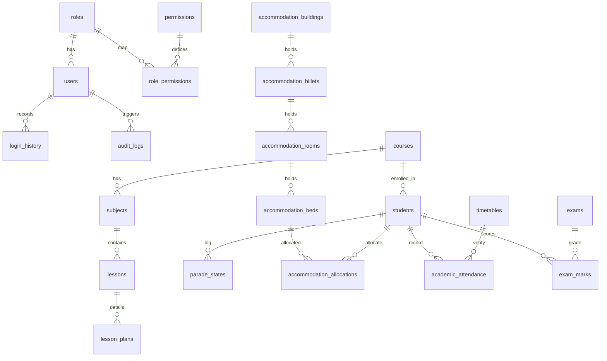
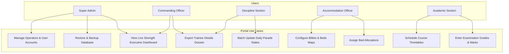
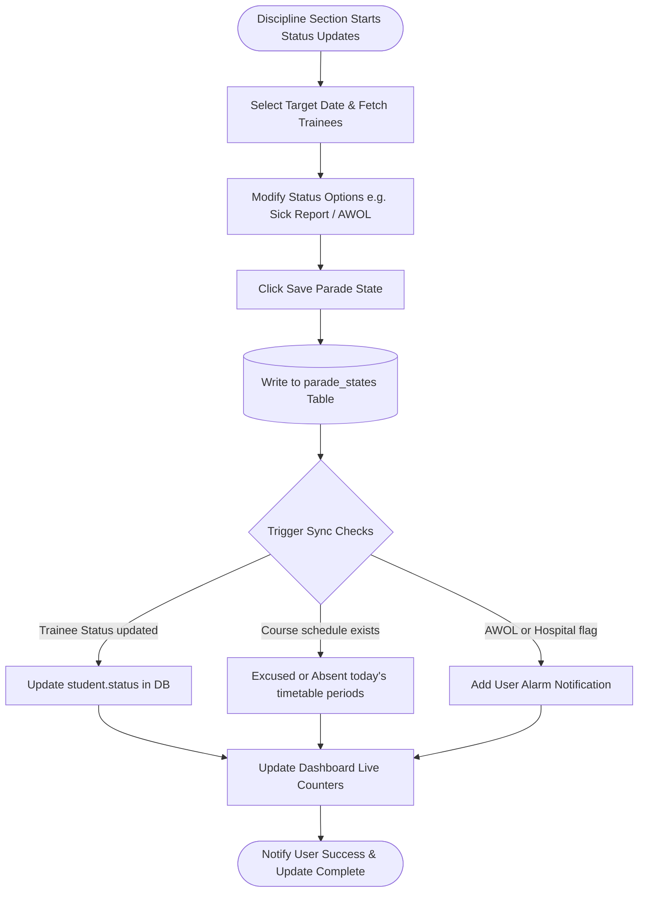
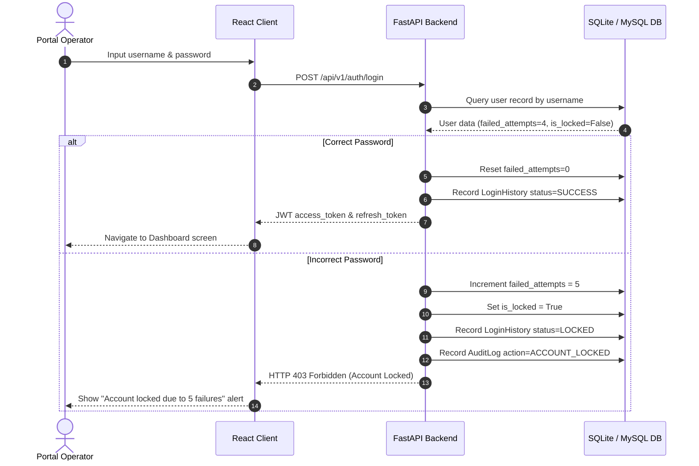
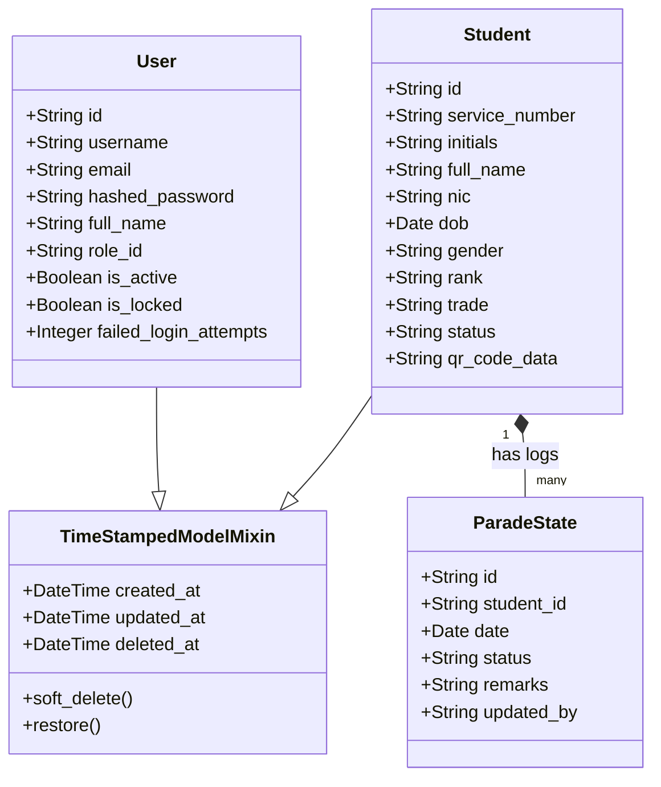
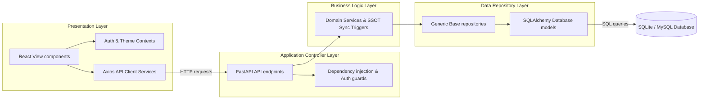
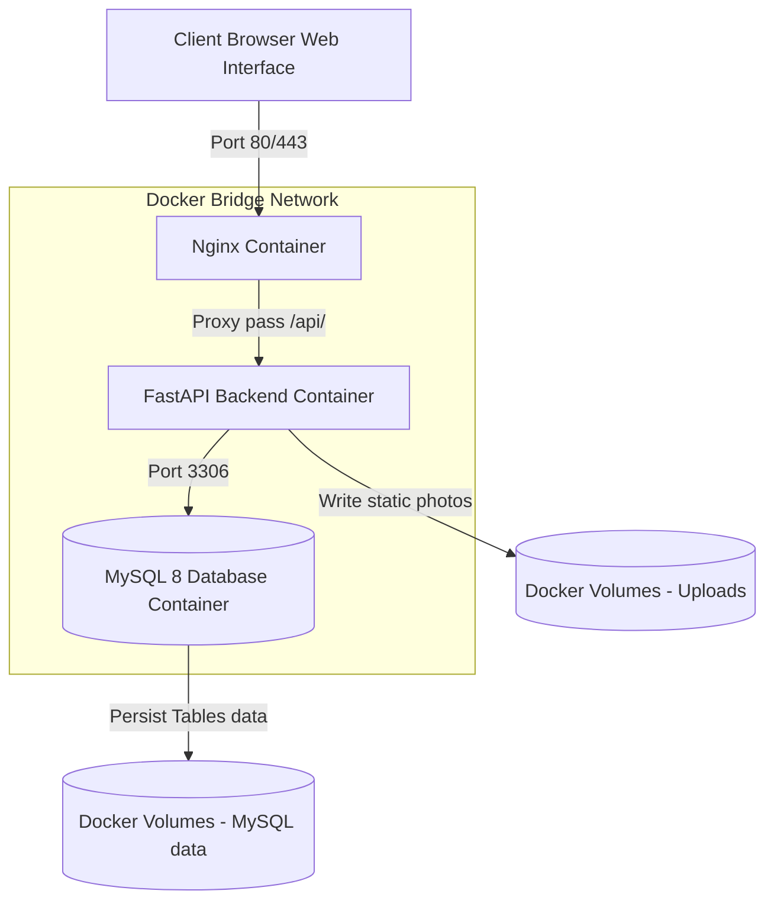

# SLAF TTS Management Portal System Architecture & Diagrams

This document contains architectural diagrams (Entity-Relationship, Use Case, Activity, Sequence, Class, Component, and Deployment) defined using Mermaid.

---

## 1. Entity-Relationship Diagram (ERD)

---

## 2. Use Case Diagram

---

## 3. Activity Diagram (Daily Parade Synchronization Workflow)

---

## 4. Sequence Diagram (User Login with Account Locking)

---

## 5. Class Diagram (Data Entities Layer)

---

## 6. Component Diagram (Layered Architecture)

---

## 7. Deployment Diagram (Containerized Network)

