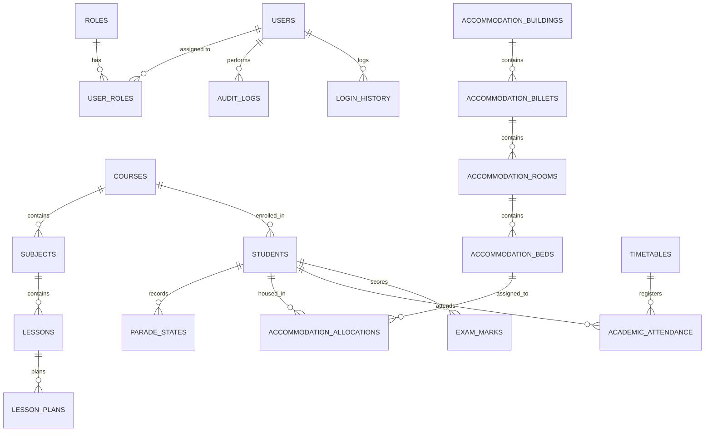

# Implementation Plan – SLAF TTS Management Portal

This document outlines the architecture, database design, technology stack, directory structure, and verification plan for the Sri Lanka Air Force Trade Training School (SLAF TTS) Management Portal.

The system is designed as a web-based, secure, and mobile-friendly application with a Single Source of Truth (SSOT) architecture centered around student details.

---

## User Review Required

We suggest the following design decisions for review:
1. **Database Strategy for Development vs. Production**: By default, the system will target MySQL 8.0 as requested. For local standalone execution without a pre-installed MySQL server, the backend can automatically fall back to SQLite if the MySQL connection fails or based on an environment variable (`DB_ENGINE=sqlite`). This ensures the app is immediately runnable.
2. **Standard Ranks and Trades Seed Data**: We will pre-seed the database with standard Sri Lanka Air Force ranks (e.g., Aircraftman, Leading Aircraftman, Corporal, Sergeant, Flight Sergeant, Warrant Officer) and trades (e.g., Airframe, Engine, Avionics, Safety Equipment, Logistical, Administrative) to make the demo immediately rich and realistic.
3. **QR Code Generation**: Student QR codes will contain their Service Number and a secure validation URL that references their master profile.

> [!IMPORTANT]
> The database follows the Third Normal Form (3NF) and leverages soft deletes (`deleted_at` fields) across all primary entities to preserve historical integrity, which is vital for audit logging in military contexts.

---

## Open Questions

1. **SLAF Squadrons and Units**: Are there specific Squadron names (e.g., No 1 Squadron, Administration Squadron, Training Squadron) that we should pre-seed?
2. **Commanding Officer Approval Workflows**: Does the Commanding Officer (CO) role require email notifications or active workflow approvals for specific actions, like student suspensions or detours? (We will implement a notifications log and simple status transition approvals).

---

## Database Design (MySQL 3NF)

Below is the database schema design featuring UUID primary keys, foreign keys, soft delete capability, audit logging, and indexing.



### Table Definitions (Summarized)
* **`roles`**: `id` (UUID), `name`, `description`.
* **`permissions`**: `id` (UUID), `name`, `code` (e.g. `student:create`).
* **`role_permissions`**: `role_id` (FK), `permission_id` (FK).
* **`users`**: `id` (UUID), `username`, `email`, `hashed_password`, `full_name`, `role_id` (FK), `is_active`, `is_locked`, `failed_login_attempts`, `created_at`, `updated_at`, `deleted_at`.
* **`students`** (SSOT Master Table): `id` (UUID), `service_number` (Unique, indexed), `initials`, `full_name`, `nic`, `dob`, `gender`, `rank`, `trade`, `course_id` (FK), `batch`, `squadron`, `unit`, `posting`, `joining_date`, `passing_out_date`, `status`, `phone`, `email`, `emergency_contact_name`, `emergency_contact_phone`, `blood_group`, `medical_category`, `religion`, `nationality`, `permanent_address`, `temporary_address`, `profile_photo_path`, `qr_code_data`, `created_at`, `updated_at`, `deleted_at`.
* **`parade_states`**: `id` (UUID), `student_id` (FK), `date` (DATE, composite index with student_id), `status` (Present, Sick Report, Hospital, Leave, Temporary Duty, Course Visit, Detached Duty, AWOL), `remarks`, `updated_by` (FK), `created_at`, `updated_at`.
* **`accommodation_buildings`**: `id` (UUID), `name`, `type` (Officers/Airmen/Airwomen), `capacity`, `created_at`, `updated_at`, `deleted_at`.
* **`accommodation_billets`**: `id` (UUID), `building_id` (FK), `name`, `capacity`, `created_at`, `updated_at`, `deleted_at`.
* **`accommodation_rooms`**: `id` (UUID), `billet_id` (FK), `room_number`, `capacity`, `created_at`, `updated_at`, `deleted_at`.
* **`accommodation_beds`**: `id` (UUID), `room_id` (FK), `bed_number`, `status` (Vacant/Occupied/Maintenance), `created_at`, `updated_at`, `deleted_at`.
* **`accommodation_allocations`**: `id` (UUID), `student_id` (FK), `bed_id` (FK), `allocated_at`, `vacated_at`, `status` (Active/Inactive), `created_at`, `updated_at`.
* **`courses`**: `id` (UUID), `code`, `name`, `description`, `duration_weeks`, `created_at`, `updated_at`, `deleted_at`.
* **`subjects`**: `id` (UUID), `course_id` (FK), `code`, `name`, `description`, `periods`, `created_at`, `updated_at`, `deleted_at`.
* **`lessons`**: `id` (UUID), `subject_id` (FK), `name`, `description`, `created_at`, `updated_at`.
* **`lesson_plans`**: `id` (UUID), `lesson_id` (FK), `instructor_id` (FK), `duration_minutes`, `objectives`, `training_aids`, `references`, `plan_doc_path`, `created_at`, `updated_at`.
* **`timetables`**: `id` (UUID), `course_id` (FK), `date`, `period_number`, `subject_id` (FK), `lesson_id` (FK), `instructor_id` (FK), `location`, `created_at`, `updated_at`.
* **`academic_attendance`**: `id` (UUID), `timetable_id` (FK), `student_id` (FK), `status` (Present/Absent/Excused), `remarks`, `created_at`, `updated_at`.
* **`exams`**: `id` (UUID), `course_id` (FK), `subject_id` (FK), `type` (Phase Test/Final Exam), `date`, `max_marks`, `pass_marks`, `created_at`, `updated_at`, `deleted_at`.
* **`exam_marks`**: `id` (UUID), `exam_id` (FK), `student_id` (FK), `marks_obtained`, `status` (Pass/Fail/Absent), `remarks`, `entered_by` (FK), `created_at`, `updated_at`.
* **`audit_logs`**: `id` (UUID), `user_id` (FK), `action`, `ip_address`, `user_agent`, `details`, `created_at`.
* **`login_history`**: `id` (UUID), `user_id` (FK), `status` (SUCCESS/FAILED), `ip_address`, `user_agent`, `created_at`.
* **`notifications`**: `id` (UUID), `user_id` (FK), `title`, `message`, `type`, `is_read`, `created_at`.

---

## Proposed Changes

We will create a multi-container Docker Setup containing:
1. **MySQL 8.0 Database** container
2. **FastAPI Python Backend** container
3. **React.js Frontend** container (compiled via Nginx or served via Vite dev server)

---

### [Component Name] Database Scripts
This component provisions the schema, initial records, and indexes.

#### [NEW] [schema.sql](file:///f:/My%20projects/TTS%20management%20system/database/schema.sql)
This file defines the full database tables, primary/foreign key relationships, indexing, and seeds standard roles, users, courses, and trades.

---

### [Component Name] FastAPI Backend Layer
This component runs the Python backend, implements OAuth2 JWT authorization, handles service business logic, repository DB queries, and seeds records.

#### [NEW] [requirements.txt](file:///f:/My%20projects/TTS%20management%20system/backend/requirements.txt)
Python package specifications (FastAPI, uvicorn, SQLAlchemy, Alembic, cryptography, passlib, PyJWT, mysql-connector-python/pymysql, python-multipart, python-dotenv).

#### [NEW] [app/main.py](file:///f:/My%20projects/TTS%20management%20system/backend/app/main.py)
Entrypoint initialization containing middleware (CORS, error logging), and main router mountpoints.

#### [NEW] [app/config.py](file:///f:/My%20projects/TTS%20management%20system/backend/app/config.py)
Configuration settings loaded from `.env` with Pydantic validation (DB details, JWT secrets, CORS settings).

#### [NEW] [app/database.py](file:///f:/My%20projects/TTS%20management%20system/backend/app/database.py)
Engine configuration with pooling and context manager dependency for SQLAlchemy sessions (`get_db`). Supports automatic fallback to a local SQLite database file if MySQL configuration is absent or fails to connect.

#### [NEW] [app/models/](file:///f:/My%20projects/TTS%20management%20system/backend/app/models/)
SQLAlchemy models matching the MySQL tables, supporting relationships and back-references:
* `base.py` (Common declarations)
* `user.py` (Users, Roles, Permissions, LoginHistory, AuditLogs)
* `student.py` (Students master table, ParadeStates)
* `accommodation.py` (Buildings, Billets, Rooms, Beds, Allocations)
* `academic.py` (Courses, Subjects, Lessons, LessonPlans, Timetables, Attendance, Exams, Marks)
* `notification.py` (Notifications)

#### [NEW] [app/schemas/](file:///f:/My%20projects/TTS%20management%20system/backend/app/schemas/)
Pydantic v2 validation models for request/response serialization:
* `user.py`
* `student.py`
* `parade.py`
* `accommodation.py`
* `academic.py`
* `dashboard.py`

#### [NEW] [app/repositories/](file:///f:/My%20projects/TTS%20management%20system/backend/app/repositories/)
Database abstraction implementing generic and specific entity operations, separating direct SQL/ORM from the business logic layer:
* `base.py`
* `user.py`
* `student.py`
* `parade.py`
* `accommodation.py`
* `academic.py`

#### [NEW] [app/services/](file:///f:/My%20projects/TTS%20management%20system/backend/app/services/)
Service layer housing core military business rules, validations, dashboard computation, security algorithms, and event synchronization:
* `auth.py` (JWT, passwords, session locking)
* `student.py` (Single Source of Truth synchronization, QR-code data generation)
* `parade.py` (Daily parade calculations and auto-updates of academic attendance status)
* `accommodation.py` (Allocation workflows and room validation)
* `academic.py` (Grade calculation and timetable verification)
* `dashboard.py` (Live statistics computation)
* `audit.py` (Audit logging logic)

#### [NEW] [app/routers/](file:///f:/My%20projects/TTS%20management%20system/backend/app/routers/)
FastAPI endpoints managing request payload parsing, dependency injection, and HTTP status codes:
* `auth.py`
* `student.py`
* `parade.py`
* `accommodation.py`
* `academic.py`
* `dashboard.py`
* `system.py`

---

### [Component Name] React Frontend Layer
This component runs the Vite-based SPA, providing light/dark mode responsive dashboard panels, calendar views, dynamic lists, forms, and charts.

#### [NEW] [package.json](file:///f:/My%20projects/TTS%20management%20system/frontend/package.json)
Frontend packages: Vite, React Router, Bootstrap 5, Bootstrap Icons, Axios, React Hook Form, Zod, Chart.js, FullCalendar, React Toastify, React Query.

#### [NEW] [src/index.css](file:///f:/My%20projects/TTS%20management%20system/frontend/src/index.css)
Global styling theme settings defining light/dark modes using modern, premium CSS variables, glassmorphic layout assets, custom typography, animations, and form designs.

#### [NEW] [src/context/AuthContext.jsx](file:///f:/My%20projects/TTS%20management%20system/frontend/src/context/AuthContext.jsx)
State manager handling user login, token refresh, RBAC rules verification, and session persistence.

#### [NEW] [src/components/Layout.jsx](file:///f:/My%20projects/TTS%20management%20system/frontend/src/components/Layout.jsx)
Dynamic Dashboard Shell with toggleable Sidebar, Breadcrumbs, Profile Menu, and Dark Mode switch.

#### [NEW] [src/pages/Dashboard.jsx](file:///f:/My%20projects/TTS%20management%20system/frontend/src/pages/Dashboard.jsx)
Commanding Officer's Executive Panel containing live strength statistics, status distribution pie charts, academic bar charts, calendar scheduling details, and notifications feed.

#### [NEW] [src/pages/Students/](file:///f:/My%20projects/TTS%20management%20system/frontend/src/pages/Students/)
* `StudentList.jsx` (Server-side paginated list with global search, filters by rank/squadron, and PDF/Excel action icons)
* `StudentForm.jsx` (React Hook Form + Zod validator supporting dynamic photo upload and profile creation)
* `StudentDetail.jsx` (Student card showing service records, QR code verification, accommodation logs, and parade history)

#### [NEW] [src/pages/ParadeState/DailyParade.jsx](file:///f:/My%20projects/TTS%20management%20system/frontend/src/pages/ParadeState/DailyParade.jsx)
Section board showing real-time list of all students and their statuses, supporting batch attendance updates.

#### [NEW] [src/pages/Accommodation/AllocationMap.jsx](file:///f:/My%20projects/TTS%20management%20system/frontend/src/pages/Accommodation/AllocationMap.jsx)
Visual grid representing building levels, billets, rooms, and beds, with click-to-allocate or vacate capabilities.

#### [NEW] [src/pages/Academic/CourseList.jsx](file:///f:/My%20projects/TTS%20management%20system/frontend/src/pages/Academic/CourseList.jsx)
Listing courses, syllabus outlines, lessons, and exam results.

---

### [Component Name] Orchestration & Documentation
Orchestrates setup and explains details of system architecture.

#### [NEW] [docker-compose.yml](file:///f:/My%20projects/TTS%20management%20system/docker-compose.yml)
Services setup: database (mysql:8), backend (FastAPI), and frontend (Vite/Node serving locally or via production build).

#### [NEW] [.env.example](file:///f:/My%20projects/TTS%20management%20system/.env.example)
Template environment configurations.

#### [NEW] [README.md](file:///f:/My%20projects/TTS%20management%20system/README.md)
Detailed setup instructions, folder structure breakdown, and architecture overview.

#### [NEW] [docs/architectures.md](file:///f:/My%20projects/TTS%20management%20system/docs/architectures.md)
Architecture designs containing ER diagrams, Use Case diagrams, Activity, Sequence, Class, Component, and Deployment diagrams in detailed Mermaid script format.

---

## Verification Plan

### Automated Tests
* We will build standard unit and integration tests inside `backend/tests` using Pytest:
  * **Auth Tests**: Testing password hashing, JWT generation, invalid credentials, locked accounts, and permission checks.
  * **SSOT Sync Tests**: Testing that when student details are updated or when daily parade state is modified, all dependent services execute successfully without data duplication.
* Run tests with:
  ```powershell
  python -m pytest backend/tests
  ```

### Manual Verification
* **Local Run**: Start the backend and frontend, login with seeded administrator credentials (`admin` / `Admin@123`).
* **Parade State Sync**: Update a student's parade state to `Sick Report` or `Leave` and verify that the student's status immediately reflects in the dashboard charts, academic attendance list, and logs.
* **Responsive Layouts**: Toggle dark mode and view dashboard on different simulated device widths (Desktop, iPad, iPhone) using browser developer tools.
* **Report Exports**: Download and open generated PDF/CSV reports to verify data accuracy.
